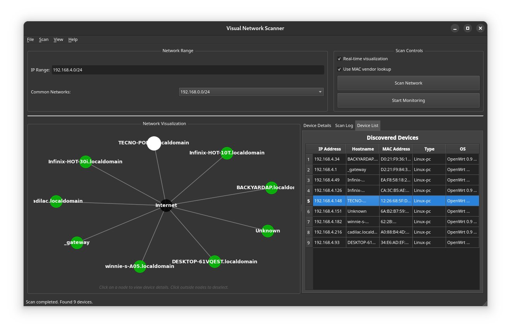

# NetShark - Visual Network Scanner

NetShark is a powerful GUI-based network scanning and visualization tool that helps you discover and monitor devices on your network. With its modern dark UI theme and interactive network graph, you can easily identify and analyze devices, services, and potential security issues on your network.



## Features

- **Interactive Network Visualization**: See your network topology with color-coded device types
- **Real-time Device Discovery**: Watch as devices are discovered during scanning
- **Multi-threaded Scanning**: Fast parallel scanning of multiple devices
- **MAC Vendor Identification**: Automatically identify device manufacturers
- **Port Visualization**: Visual representation of open ports and services
- **Continuous Monitoring**: Track devices joining and leaving your network
- **Persistent Database**: Store scan results for historical comparison
- **Dark Theme UI**: Easy on the eyes for security professionals

## Requirements

- Python 3.8+
- PyQt5
- matplotlib
- networkx
- scapy
- python-nmap
- requests

## Installation

1. Clone the repository:
```bash
git clone https://github.com/phantom-kali/NetShark.git
cd NetShark
```

2. Create and activate a virtual environment:
```bash
python -m venv .venv
source .venv/bin/activate  # On Windows: .venv\Scripts\activate
```

3. Install required packages:
```bash
pip install -r requirements.txt
```

4. Install nmap:
- Ubuntu/Debian: `sudo apt install nmap`
- Fedora/RHEL: `sudo dnf install nmap`
- Arch Linux: `sudo pacman -S nmap`
- Windows: Download from [nmap.org](https://nmap.org/download.html)

## Usage

NetShark requires root/administrator privileges to perform network scanning.

### Running the Application

Linux/macOS:
```bash
sudo ./.venv/bin/python ./main.py
```

Windows (as Administrator):
```cmd
.venv\Scripts\python.exe main.py
```

### Basic Usage

1. Enter IP range in CIDR notation (e.g., `192.168.1.0/24`)
2. Click "Scan Network" to start scanning
3. Watch the network graph populate with discovered devices
4. Click nodes to view device details
5. Use "Device List" tab for tabular view

### Continuous Monitoring

1. Enter IP range to monitor
2. Click "Start Monitoring"
3. Wait for periodic device checks
4. Click "Stop Monitoring" to end

### Scan Options

- Real-time visualization
- MAC vendor lookup
- Cancel scan capability

## Advanced Features

### MAC Vendor Lookup
Identifies device manufacturers using MAC addresses. Requires internet connectivity.

### Multi-threaded Scanning
Uses parallel processing for faster network scanning.

### Database Storage
Stores results in SQLite database (`network_scanner.db`).

## Permissions & Security

Requires root/administrator privileges for:
- ARP scanning
- OS fingerprinting
- Port scanning

**⚠️ Warning**: Only scan networks you own or manage.

## Troubleshooting

- **Permission errors**: Run with admin/root privileges
- **No devices**: Check network/firewall settings
- **Slow scans**: Reduce IP range or disable MAC lookup
- **Crashes**: Check `network_scanner.log`

## Contributing

1. Fork repository
2. Create feature branch
3. Commit changes
4. Push to branch
5. Submit Pull Request

## License

MIT License. See `LICENSE` file.

## Acknowledgments

- [Scapy](https://scapy.net/)
- [Nmap](https://nmap.org/)
- [NetworkX](https://networkx.org/)
- [PyQt5](https://www.riverbankcomputing.com/software/pyqt/)
- [Matplotlib](https://matplotlib.org/)
